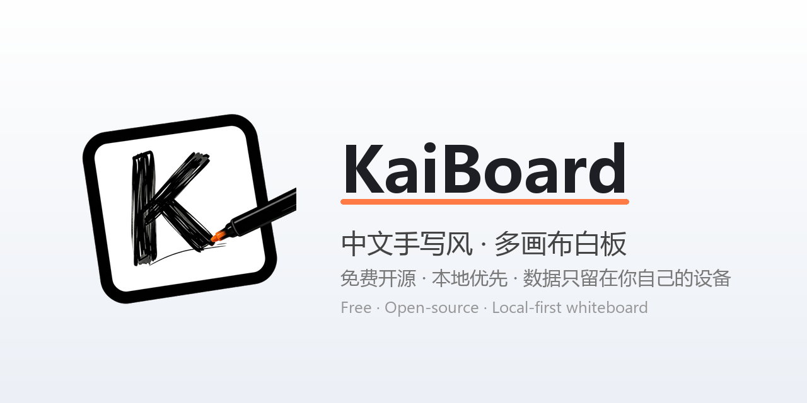

<p align="center">
  <a href="README.md">English</a> &middot; <a href="README.zh-CN.md">中文</a>
</p>

<p align="center">
  
</p>

# KaiBoard

A free, open-source, **local-first multi-board whiteboard with Chinese & English handwriting fonts**. Its drawing engine is built on open-source [Excalidraw](https://github.com/excalidraw/excalidraw) (MIT).

> **One-line pitch**: No account, no cloud — your data stays on your own device. Built for personal single-user use; no real-time collaboration. On top of the drawing engine, KaiBoard adds the "multi-file / multi-board management" capability Excalidraw lacks natively, plus trash and cross-device migration.

> **🙏 About the engine & credits**: KaiBoard's canvas drawing abilities (pen, shapes, infinite canvas, images, frames, etc.) are 100% from open-source [Excalidraw](https://github.com/excalidraw/excalidraw) (MIT). We are grateful to the Excalidraw team and the open-source community for the high-quality drawing engine that makes "local-first multi-board whiteboard" possible. KaiBoard's additions on top — multi-board organization, local optimization, and shell capabilities — are its own. See [`docs/FEATURES.md`](docs/FEATURES.md).

> **Design reference**: The interaction paradigm for multi-board management references the general design of mature multi-board whiteboard products; the drawing engine and concrete engineering implementation are completed by KaiBoard itself.

See [`docs/FEATURES.md`](docs/FEATURES.md) for the full feature list.

## ✨ Key features

- **Local-first & private** — data in your browser (IndexedDB) or a folder you choose (File System Access API, Chrome/Edge); no account, no upload.
- **Multi-board workspace (core)** — folder-tree of boards, arbitrarily nested; drag to organize, right-click menu, trash/recovery, sidebar search.
- **Import / export & migration** — native `.excalidraw` exchange, workspace backup with parallel-merge migration, batch import, PPTX export.
- **Chinese & English handwriting** — built-in Xiaolai (Chinese) + Virgil (English) handwriting fonts; Simplified / Traditional Chinese / English UI; light & dark themes.
- **Onboarding** — first-run sample, empty-board welcome, element comments.
- **Infinite canvas** — inherited from Excalidraw.

## 🚀 Quick start

```bash
npm install
npm run dev
# defaults to http://localhost:5173
```

`npm run dev` auto-runs `scripts/prepare-fonts.mjs` before starting, generating fonts from the installed `@excalidraw/excalidraw` dependency (`dist/prod/fonts`) into `public/fonts` — **fonts are not committed to the repo** and are force-synced every time (see `.gitignore`).

## 📦 Build to a static directory

```bash
npm run build       # base edition (public release), output in dist-basic/
npm run build:ai    # AI edition (local only, needs gitignored _agent_private), output in dist/
npm run preview     # preview base edition (vite preview --outDir dist-basic)
```

> Do not open `dist-basic/index.html` directly — Excalidraw 0.18+ is ESM and loads fonts via `fetch`, which `file://` blocks by CORS. Use a static server:
> ```bash
> npm run preview   # or
> npx serve dist
> ```

## 🛠 Tech stack

| Item | Choice |
|---|---|
| Build | Vite 5 |
| Framework | React 18.3 |
| Canvas | `@excalidraw/excalidraw@0.18.1` |
| Storage | IndexedDB (idb), db name `kaiboard` |
| Chinese & English handwriting | Chinese Xiaolai (小赖体) + English Virgil (Excalidraw default), self-hosted, offline (SIL OFL-1.1; generated at build time from `@excalidraw/excalidraw`, not committed) |

## 📂 Data model

IndexedDB database `kaiboard`:

| Store | key | Content |
|---|---|---|
| `files` | `id` | file-tree node `FileNode { id, type:'folder'\|'board', name, parentId, createdAt, updatedAt, order, deletedAt?, trashRoot? }` |
| `boards` | `id` (= board id) | board content `BoardData { id, elements, appState, files }` |
| `settings` | string key (out-of-line) | UI state: `expanded` / `lastBoardId` / `sidebarWidth` / `sidebarCollapsed` / `theme` |

> Board content is stored in the `boards` store by **the board's own id** (one-to-one with the file-tree node).

## ⚠️ Known issues / notes

- **Collaboration disabled**: the offline scenario explicitly hides collaboration UI to avoid needless network requests and console errors.
- **Font size**: the Chinese handwriting font is ~2.6 MB woff2, slightly slow on first load (Virgil override keeps it offline); **fonts are generated at build time and not distributed with the repo**.
- **Image attachments**: images pasted in Excalidraw are stored as base64 in `boards.files`, consuming IndexedDB quota; in extreme cases clear via DevTools.
- **Multiple tabs**: different tabs each hold a canvas instance; concurrent edits resolve to the last save.

## 🔄 Dependency version & upgrade strategy

KaiBoard pins `@excalidraw/excalidraw@0.18.1` (see Tech stack). On "what happens on future updates":

- **No auto-follow**: npm deps are pinned; unless we actively change `package.json` and reinstall, it stays at 0.18.1 — we control upgrade timing.
- **Upgrades are deliberate + need evaluation**: Excalidraw has breaking changes across versions (e.g. `appState` structure, `restore()` signature, collaboration API). KaiBoard wraps the engine (e.g. official `restore()` to fix cross-version white-screen, bind `langCode`, take over `onChange` auto-save, dual-backend storage); a major upgrade needs re-regression of our shell integration.
- **Excalidraw's "AI / diagram" advanced features are NOT in the open-source npm package**: they exist only on hosted excalidraw.com / Excalidraw+. Even upgrading the npm package won't auto-grant their AI — that would require KaiBoard to wire an LLM itself.
- **Recommended**: keep pinned versions for stability; when a specific new capability is truly needed, scope an upgrade evaluation + regression (incl. white-screen fallback, dual-backend storage, i18n) before release.

## 📁 Project structure

### Top-level files & directories

```
kaiboard/
├─ .gitignore               # ignores: build output, build-time fonts, browser cache, etc.
├─ README.md                # this file (English, canonical)
├─ README.zh-CN.md          # Chinese version
├─ CHANGELOG.md             # version history
├─ LICENSE                  # MIT
├─ THIRD_PARTY_LICENSES     # third-party license summary (Excalidraw, etc.)
├─ index.html               # HTML entry; sets window.EXCALIDRAW_ASSET_PATH = "/"
├─ package.json             # deps & scripts (dev / build (base) / build:ai (AI) / preview)
├─ package-lock.json        # locked deps
├─ preview-local.bat        # one-click local preview (AI 3000 / base 3001)
├─ vite.config.ts           # Vite config (incl. @agent alias dual-path switch)
├─ tsconfig.json            # TypeScript config
├─ docs/                    # docs
│  └─ FEATURES.md           # KaiBoard feature details (must-read for contributors/users)
├─ public/                  # static assets
│  ├─ announcements.json    # announcement bar text
│  └─ (fonts generated at build time by prepare-fonts.mjs from @excalidraw/excalidraw into public/fonts/; favicon inlined as data URI)
├─ scripts/                 # build scripts
│  ├─ prepare-fonts.mjs     # font prep (Excalidraw official + Chinese & English handwriting)
│  ├─ build-ai.mjs          # AI edition build
│  └─ build-basic.mjs       # base edition build (VITE_AI_ENABLED=false)
└─ src/                     # source (see next)
```

### Core source structure

```
src/
├─ main.tsx              # entry: import excalidraw/index.css + fonts.css + styles.css
├─ fonts.css             # @font-face overrides Virgil with Chinese handwriting
├─ styles.css            # app layout
├─ db.ts                 # IndexedDB wrapper (files / boards / settings; soft-delete & trash, settings RW)
├─ App.tsx               # main component: file tree, auto-save, multi-board switch, context menu, theme, breadcrumb, save indicator
├─ Sidebar.tsx           # file tree (search / inline rename / drag / empty right-click / trash entry)
├─ ContextMenu.tsx       # context menu (export / duplicate / copy link / cut-copy-paste)
├─ TrashPanel.tsx        # trash modal (restore / permanent delete / empty)
└─ exportImport.ts       # export (workspace backup / single board .excalidraw), import (parallel merge, mandatory tree node, strip trash markers)
```

## 📄 License

- KaiBoard itself is released under the **MIT License**; full text in [LICENSE](./LICENSE).
- Third-party dependencies (including Excalidraw as the drawing engine) licenses in [THIRD_PARTY_LICENSES](./THIRD_PARTY_LICENSES).
- This product is built on open-source [Excalidraw](https://github.com/excalidraw/excalidraw) (MIT), follows its MIT and retains its copyright notices; its official promotional links (blog / YouTube) and brand have been removed from the product UI, but the license text is fully retained.
- The Chinese handwriting font (Xiaolai 小赖体, chosen/optimized by excalidraw-cn for Chinese scenarios) follows the SIL Open Font License.
